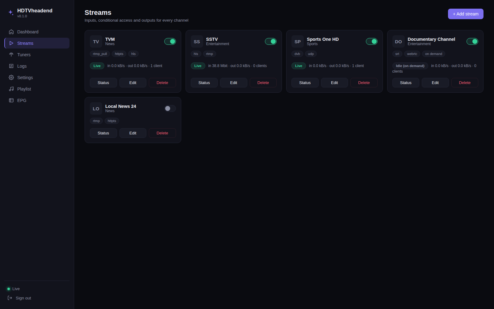

<div align="center">

# HDTVheadend

A single-binary DVB/IP streaming headend — tune, pull, receive, descramble, and republish live TV over a modern web dashboard. No ffmpeg, no external runtime dependencies, no dynamic linking. Just one static binary.



</div>

## Why

Most open-source headends (TVHeadend, etc.) are powerful but old — clunky UIs, C dependencies, and years of accumulated complexity. HDTVheadend is a from-scratch rewrite in Go with one goal: **a single static binary you can drop on any Linux box and have a full streaming headend running in under a minute**, with a dashboard that doesn't look like it's from 2009.

## Features

### Inputs
| Type | Description |
|---|---|
| **HTTP-TS** | Pull a continuous raw MPEG-TS stream over HTTP(S) |
| **UDP / RTP** | Receive unicast or multicast UDP, with or without RTP framing |
| **HLS** | Pull an HLS (`.m3u8`) source — handles both master and media playlists |
| **DASH** | Pull an MPEG-DASH (`.mpd`) source |
| **DVB tuner** | Direct hardware tuning — DVB-S/S2, DVB-T/T2, DVB-C |
| **SRT** | Caller or listener mode, with passphrase (AES) and stream ID support |
| **RTSP** | Pull an RTSP source |
| **RTMP / RTMPS** | Run as an ingest server — accept a push from OBS or any encoder |
| **RTMP pull** | Connect out as a client and play a stream someone else is already serving |
| **WebRTC (WHIP)** | Accept a WHIP publisher (OBS 30+, browsers) — video (H.264) only |
| **YouTube** | Alias for HLS — paste your own extracted `.m3u8` URL (no scraping, no bot-detection bypass) |

Every input supports **failover**: configure backup sources tried in order, with automatic failover and manual source switching from the dashboard.

### Outputs
| Type | Description |
|---|---|
| **HTTP-TS** | Serve raw MPEG-TS to any number of concurrent clients |
| **UDP / multicast** | Send to a unicast or multicast destination, with TTL and optional RTP wrapping |
| **SRT** | Caller or listener mode |
| **RTSP** | Serve as an RTSP source |
| **HLS / DASH** | Segmented adaptive streaming, configurable segment length/window |
| **RTMP / RTMPS** | Push out to YouTube Live, Twitch, or any RTMP ingest |
| **WebRTC (WHEP)** | Browser-playable low-latency output — video only |

Every output that serves live viewers benefits from **instant-join buffering**: a new viewer gets seeded from the most recent keyframe instead of waiting out whatever's left of the source's GOP interval.

### Conditional access
- **BISS-1** (session word) and **BISS-E/CA** (control word) software descrambling
- **CI/CI+** hardware CAM support (real, licensed smart cards — no CCcam/Newcamd, by design)

### Stream lifecycle
- **Static** mode: input runs continuously while the stream is enabled
- **On-demand** mode: input starts only when a viewer actually connects (HTTP-TS/HLS/DASH/WHEP), and stops again after a period of no demand — saves source bandwidth for pull-style inputs nobody's currently watching

### Dashboard
- Live input/output bandwidth per stream and in aggregate, updated in real time over **Server-Sent Events** — no polling
- Add, edit, and delete streams live, with no restart required
- Per-stream status: source health, active/backup source, manual failover switching, copy-pasteable output links
- **Logs page**: live-tailing application log with filtering, pause/resume — see exactly what's happening without shell access
- DVB tuner overview
- M3U playlist (`/playlist.m3u8`) and XMLTV EPG (`/epg.xml`) endpoints, ready for any player
- Session-based auth with an optional IP allow-list

### Observability
- Prometheus metrics at `/metrics`
- Optional shipping of metrics to **VictoriaMetrics** and logs to **VictoriaLogs** (both external, operator-run — nothing bundled)

## What this project deliberately does not do

- **No CCcam / Newcamd.** Card-sharing protocols are used overwhelmingly for piracy; not supported, and won't be.
- **No YouTube scraping or bot-detection bypass.** The YouTube input is a labeled alias for HLS — you extract your own `.m3u8` URL for a stream you own or are authorized to redistribute, and paste it in.
- **No ffmpeg, no cgo, no dynamic dependencies.** Everything — TS muxing/demuxing, H.264/AAC framing, every protocol — is implemented in pure Go.

## Quick start

Download or build a binary for your architecture (see [Building](#building) below), then:

```bash
sudo ./hdtvheadend-linux-amd64 -install
```

This installs the binary to `/opt/hdtvheadend/hdtvheadend`, writes a default config to `/opt/hdtvheadend/config.json`, sets up and starts a systemd service, and prints the admin credentials. The dashboard is then at `http://<this-machine>:8088`.

Use `-listen ":9000"` to pick a different port at install time. To remove it:

```bash
sudo ./hdtvheadend-linux-amd64 -uninstall
```

### Running without installing

```bash
./hdtvheadend-linux-amd64 -config /path/to/config.json
```

If the config file doesn't exist yet, it'll tell you to run `-install` first, or you can hand-write a minimal one:

```json
{
  "listen_addr": ":8088",
  "admin": { "username": "admin", "password_hash": "" },
  "streams": []
}
```
(Set a real `password_hash` via the Settings page after first login, or generate one with bcrypt.)

## Building

Requires Go 1.21+. No cgo, no external tools.

```bash
git clone https://github.com/<you>/hdtvheadend.git
cd hdtvheadend
go build -trimpath -ldflags="-s -w" -o hdtvheadend .
```

### Cross-compiling

```bash
CGO_ENABLED=0 GOOS=linux GOARCH=amd64             go build -trimpath -ldflags="-s -w" -o dist/hdtvheadend-linux-amd64 .
CGO_ENABLED=0 GOOS=linux GOARCH=arm64             go build -trimpath -ldflags="-s -w" -o dist/hdtvheadend-linux-arm64 .
CGO_ENABLED=0 GOOS=linux GOARCH=arm GOARM=7       go build -trimpath -ldflags="-s -w" -o dist/hdtvheadend-linux-armv7 .
CGO_ENABLED=0 GOOS=linux GOARCH=386               go build -trimpath -ldflags="-s -w" -o dist/hdtvheadend-linux-386 .
```

Every target produces a fully static binary — verify with `file dist/hdtvheadend-linux-amd64`, it should say `statically linked`.

### Running the tests

```bash
go test ./...
```

## Configuration

Streams are managed entirely through the web dashboard, but the underlying `config.json` is plain and hand-editable if you prefer:

```json
{
  "listen_addr": ":8088",
  "admin": { "username": "admin", "password_hash": "$2a$10$..." },
  "allowed_ips": [],
  "streams": [
    {
      "id": "example",
      "name": "Example Channel",
      "group": "News",
      "input": { "type": "hls", "url": "https://example.com/live/index.m3u8" },
      "backup_inputs": [],
      "outputs": [
        { "type": "httpts", "path": "/stream/example.ts" },
        { "type": "hls", "path": "/hls/example/" }
      ],
      "mode": "static",
      "enabled": true
    }
  ]
}
```

Changes made via the dashboard are written straight back to this file and applied live — no restart needed for adding, editing, or removing a stream.

## API

The dashboard is a thin client over a JSON API (all under `/api/`, session-cookie authenticated):

- `GET/POST /api/streams`, `GET/PUT/DELETE /api/streams/{id}` — manage streams
- `GET /api/status` — live counters for every stream; `GET /api/events` — the same, pushed over SSE
- `GET /api/logs`, `GET /api/logs/events` — buffered/live application logs
- `GET /api/network-interfaces` — this machine's local IPs, for picking a listen address
- `GET /api/settings`, `PUT /api/settings` — admin account, allow-list, EPG sources
- `POST /api/streams/{id}/switch-source` — manual failover control

Unauthenticated, always on:
- `GET /metrics` — Prometheus text format
- `GET /playlist.m3u8`, `GET /epg.xml` — for any player/PVR

## Architecture

Pure Go, organized as small, single-purpose packages under `internal/`:

- `tsmux` / `tsutil` — MPEG-TS muxing/demuxing from scratch
- `codecs/h264`, `codecs/aac` — Annex-B/AVCC framing, SPS parsing, ADTS/ASC handling
- `input/*`, `output/*` — one package per protocol
- `streambus` — the in-process fan-out hub every input feeds and every output reads from, with the instant-join GOP cache
- `dynhttp` — an HTTP router whose routes can be added/removed at runtime (unlike `net/http.ServeMux`), since streams are edited live
- `failover` — source health tracking and automatic/manual switching
- `manager` — wires a stream's input, CA, and outputs together
- `webui` — the dashboard's static assets, JSON API, and SSE endpoints

## License

[Choose and add a LICENSE file — e.g. MIT or Apache-2.0 — before publishing.]

## Acknowledgments

**Libraries.** Built on a small number of focused, permissively-licensed Go libraries: [pion/webrtc](https://github.com/pion/webrtc) for WHIP/WHEP, [datarhei/gosrt](https://github.com/datarhei/gosrt) for SRT, and a locally-patched fork of [yutopp/go-rtmp](https://github.com/yutopp/go-rtmp) (Boost Software License) for RTMP — see `third_party/go-rtmp` for the specific fixes applied upstream via [PR #72](https://github.com/yutopp/go-rtmp/pull/72), plus additional fixes for client-side play support and encoder-side extended-timestamp handling found during development.

**Reference projects.** No code was copied from any of these — they were studied for architecture and protocol-handling ideas during development, each kept in mind alongside its actual license:
- [SRS (Simple Realtime Server)](https://github.com/ossrs/srs) (MIT) — SRT/RTMP/WebRTC server design
- [MediaMTX](https://github.com/bluenviron/mediamtx) (MIT) — WebRTC (WHIP/WHEP) handling patterns
- [ZLMediaKit](https://github.com/ZLMediaKit/ZLMediaKit) (MIT) — general media server architecture
- [Hydra-SRT](https://github.com/varlanv/hydra-srt) (Apache-2.0) — original inspiration for the SRT-centric feature set
- [monibuca](https://github.com/langhuihui/monibuca) (AGPLv3) — architecture reference only; AGPL code was never used or adapted, by design, since this project is not AGPL-licensed
